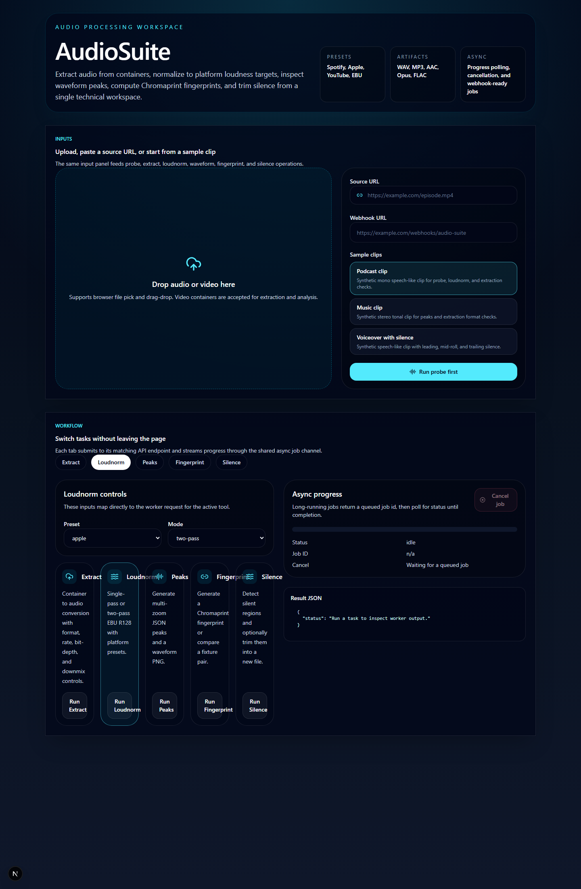

# AudioSuite

AudioSuite is an open-source audio toolkit that extracts audio, runs EBU
R128 loudness normalisation, generates waveform peaks, computes
Chromaprint fingerprints, and detects silence for podcast and video
production workflows.



## Status

The repository now includes:

- A Next.js 15 playground in `apps/web`
- A FastAPI worker in `apps/worker`
- Local synthetic sample fixtures in `samples/`
- Async job polling, cancellation, and webhook delivery

## Stack

- Next.js 15 playground in `apps/web`
- FastAPI worker in `apps/worker`
- Shared TypeScript contracts in `packages/shared-types`
- Docker Compose for local self-hosting

## Local development

```bash
pnpm install
pnpm dev
```

Worker development:

```bash
cd apps/worker
python -m venv .venv
.venv\Scripts\activate
pip install -r requirements.txt
uvicorn app.main:app --reload --port 8000
```

Docker Compose uses `AUDIO_SUITE_WEB_PORT`,
`AUDIO_SUITE_WORKER_PORT`, and `AUDIO_SUITE_WORKER_PUBLIC_URL` when
you need non-default host ports.

## Self-host with Docker

```powershell
$env:AUDIO_SUITE_WEB_PORT="3002"
$env:AUDIO_SUITE_WORKER_PUBLIC_URL="http://localhost:8000"
docker compose up --build -d
```

Then open `http://localhost:3002` for the playground and
`http://localhost:8000/health` for the worker health check.

The worker logs its detected `ffmpeg` and `fpcalc` versions during
startup so you can verify the runtime binaries inside the container:

```powershell
docker logs audio-loudnorm-online-worker-1 --tail 20
```

## Sample fixtures

Synthetic fixtures live in `samples/` and back the in-app sample picker,
worker smoke tests, and future acceptance checks.

```bash
python scripts/generate_sample_fixtures.py
```

## Container smoke check

When Docker Desktop is running, this script builds the worker image and
exercises sample-based probe, extract, loudnorm, peaks, fingerprint,
and silence endpoints:

```powershell
powershell -ExecutionPolicy Bypass -File scripts/smoke_worker_container.ps1
```

## SEO-friendly routes

The web app publishes these product routes:

- `/loudnorm-online`
- `/ebu-r128-online`
- `/podcast-loudnorm`
- `/audio-fingerprint-online`
- `/waveform-generator`

## License

AGPL-3.0-only
