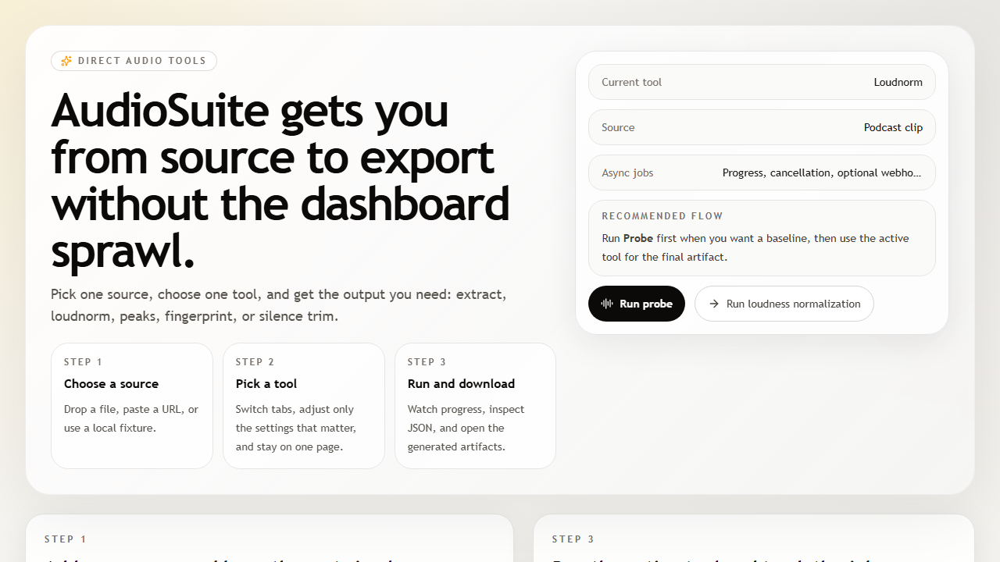

# AudioSuite

AudioSuite is an open-source audio toolkit that extracts audio, runs EBU
R128 loudness normalisation, generates waveform peaks, computes
Chromaprint fingerprints, and detects silence for podcast and video
production workflows.



## Status

The repository includes:

- A Next.js 15 playground in `apps/web` with the tool on the home page
- A FastAPI worker in `apps/worker`
- Local synthetic sample fixtures in `samples/`
- Async job polling, cancellation, and webhook delivery

## Stack

- Next.js 15 playground in `apps/web`
- FastAPI worker in `apps/worker`
- Shared TypeScript contracts in `packages/shared-types`
- Docker Compose for local self-hosting

## Local development

Copy `.env.example` to `.env` and adjust values if needed.

```bash
pnpm install
pnpm dev
```

Worker development:

```bash
cd apps/worker
python -m venv .venv
source .venv/bin/activate
pip install -r requirements.txt
uvicorn app.main:app --reload --port 8000
```

Set `NEXT_PUBLIC_AUDIO_SUITE_API_BASE_URL=http://localhost:8000` when
running the web app against a local worker.

Docker Compose uses `AUDIO_SUITE_WEB_PORT`,
`AUDIO_SUITE_WORKER_PORT`, and `AUDIO_SUITE_WORKER_PUBLIC_URL` when
you need non-default host ports.

## Self-host with Docker

```bash
export AUDIO_SUITE_WEB_PORT=3002
export AUDIO_SUITE_WORKER_PUBLIC_URL=http://localhost:8000
docker compose up --build -d
```

Then open `http://localhost:3002` for the playground and
`http://localhost:8000/health` for the worker health check.

The home page is the interactive UI: Extract, Loudnorm, Peaks,
Fingerprint, and Silence tabs with async progress, cancellation, and
artifact links. `/workspace` redirects to `/`.

The worker logs its detected `ffmpeg` and `fpcalc` versions during
startup so you can verify the runtime binaries inside the container:

```bash
docker compose logs worker --tail 20
```

Set `NEXT_PUBLIC_SITE_URL` to your public web origin in production so sitemap,
robots, and Open Graph metadata use the correct hostname.

## Sample fixtures

Synthetic fixtures live in `samples/` and back the in-app sample picker,
worker smoke tests, and acceptance checks.

```bash
python scripts/generate_sample_fixtures.py
```

## Governance

- [License](LICENSE) (AGPL-3.0-only)
- [Contributing](CONTRIBUTING.md)
- [Code of Conduct](CODE_OF_CONDUCT.md)
- [Security Policy](SECURITY.md)

## Legal (web app routes)

When the web app is running, these pages are served at `/privacy` and `/terms`.
Source copies live in `apps/web/app/privacy/page.tsx` and `apps/web/app/terms/page.tsx`.

## SEO-friendly routes

The web app publishes these product routes:

- `/loudnorm-online`
- `/ebu-r128-online`
- `/podcast-loudnorm`
- `/audio-fingerprint-online`
- `/waveform-generator`

## License

AGPL-3.0-only
